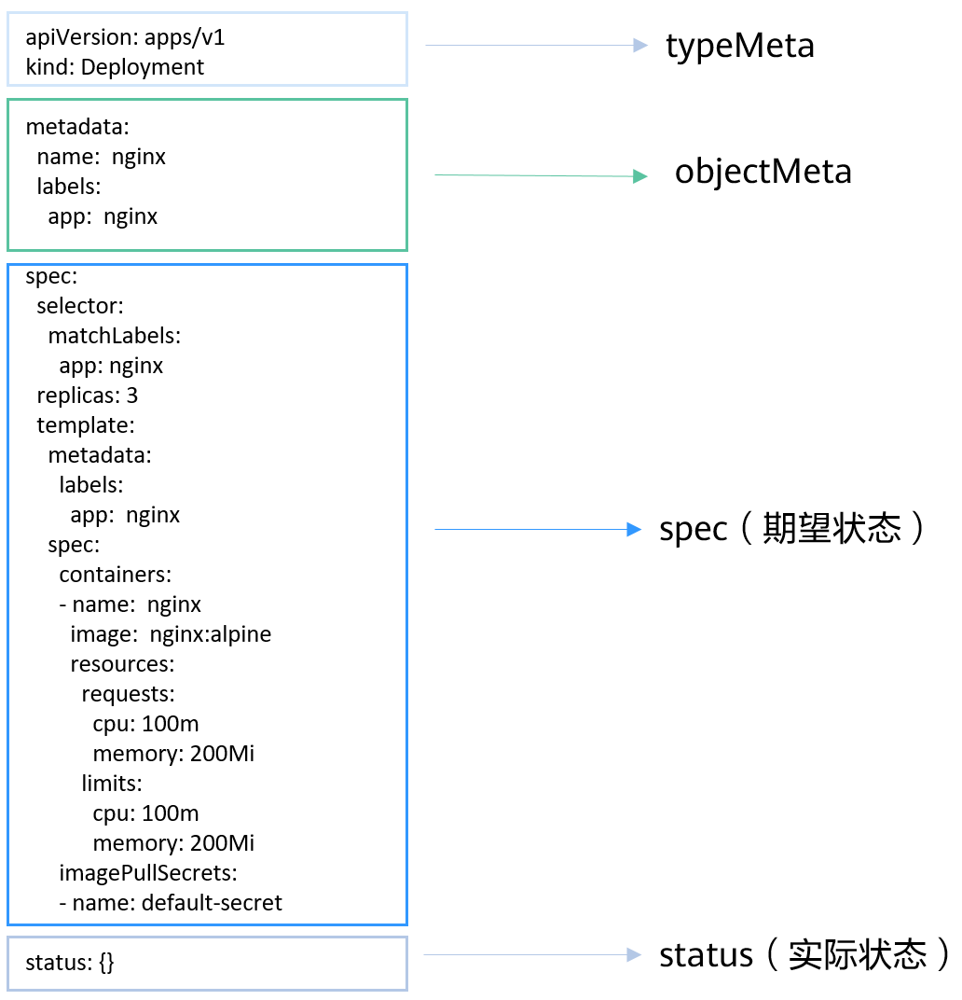
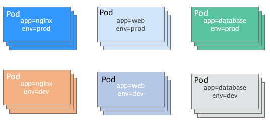

>NOTE:本文参考[华为云文档](https://support.huaweicloud.com/basics-cce/kubernetes_0002.html)

# 1 容器与Kubernetes

## 1.1 容器

### 1 容器优点

相比于虚拟机，容器具有如下优点：

- 更高效的资源利用
- 更快速的启动时间
- 一致的运行环境
- 更轻松的迁移、维护和扩展

### 2 Docker容器典型的使用流程

Docker容器的主要概念：

- 镜像：Docker镜像包含了已打包的应用程序及其依赖的环境。它包含应用程序可用的文件系统和其他元数据，如镜像运行时的可执行文件路径
- 镜像仓库：Docker镜像仓库用于存放Docker镜像。
- 容器：一个运行中的容器就是一个运行在Docker主机上进程。

Docker容器典型使用流程如下图所示：


## 1.2 Kubernetes

### 1.2.1 是什么

kubernetes是一个部署和管理容器化应用，并对容器进行调度和编排的软件系统。

kubernetes提供了服务发现、伸缩、负载均衡、自愈设置选举等功能，让开发者从基础设施相关配置等解脱出来。

### 1.2.2 集群架构

Kubernetes集群包括master节点和node节点。应用部署在node节点上，且可以通过配置选择应用部署在某些特定节点上。kubernetes集群架构如下图所示：


#### master节点

master节点是集群的控制节点，主要由一下4个组件构成：

- API server：集群的入口，接受外部请求，并将信息写入etcd。是个组件相关通信的中转站。
- scheduler：调度应用，根据各种条件(如可用资源、节点亲和性等)将容器调度到node上。
- controller manager：执行集群级功能，如复制组件，跟踪node节点，处理节点故障等
- etcd：分布式数据存储，负责存储集群的配置信息

生产环境中，为了保证集群的高可用，通常会部署多个Master。

#### node节点

node节点是集群的计算节点，即运行容器化应用的节点。主要包含以下组件：

- kubelet: kubelet主要负责同container runtime打交道，并与API server交互，管理节点上的容器。
- kube-proxy:应用组件键的访问代理，解决节点上应用的访问问题。
- container runtime:容器运行时，最主要的功能是下载镜像和运行容器。

### 1.2.3 kubernetes的扩展性

kubernetes开放了容器运行时结构CRI，容器网络接口CNI和容器存储接口CSI，这些接口让kubernetes的扩展性最大化，而kubernetes本身则专注于容器调度。

### 1.2.4 kubernetes中的基本对象

kubernetes基本对象及其之间的关系如下图所示：


- pod:kubernetes创建或部署的最小单位。一个Pod分装一个或多个container，存储资源volume、一个独立的网络IP以及管理控制容器运行方式的策略选项。
- Deployment：对Pod的服务化封装，其可以包含一个或多个Pod，每个Pod的角色相同，所以系统会自动为Deployment的多个Pod分发请求
- StatefulSet：管理有状态应用。与Deployment相同的是，StatefulSet管理了基于相同容器定义的一组Pod；但与Deployment不同的是，StatefulSet为每个Pod维护了一个固定的ID。这些Pod基于相同的声明来创建的，但不能相互替换，无论如何调度，每个Pod都有一个永久不变的ID
- Job：控制批处理型任务对象。批处理业务与长期伺服业务(Deployment)的主要区别是批处理任务的运行有头有尾，而长期伺服业务在用户不停止的情况下永远运行。Job管理的Pod根据用户的设置把任务成功完成就自动退出(Pod自动删除)
- CronJob:基于时间控制的job，类似于Linux系统的crontab，在指定的时间周期运行指定的任务。
- Daemonset:守护进程，在集群的每个节点都运行一个Pod，且保证只有一个Pod。这非常适合系统层面的应用，如日志收集，资源监控，这类应用需要每个节点都运行，且不需要太多实例，一个比较好的例子就是kubernetes的kube-proxy
- service:由于Pod的IP不是固定不变的，所以采用service来解决Pod访问的问题。service有一个固定IP，service将流量转发给Pod，且为这些Pod做负载均衡
- ingress:service是基于四层tcp和udp协议转发，Ingress可以基于七层的HTTP和https协议转发，可通过域名和路径做更细粒度的划分
- ConfigMap：用于存储应用所需的配置信息的资源类型，用于保存配置数据的键值对。通过ConfigMap可以方便的做到配置解耦，使得不同环境有不同配置
- Secret：一种加密存储的资源对象，可以将认证信息，证书，私钥等保存在Secret中，而不需要将这些敏感数据暴露到镜像或Pod定义中，从而更加安全和灵活。
- PersistentVolume(PV):PV持久化数据存储卷，主要定义的是一个持久化存储在宿主机上的目录，如一个NFS挂在目录。
- PersistentVolumeClaim(PVC):kubernetes提供PVC专门用于持久化存储的申请，PVC可以让开发者无需关心底层存储资源如何创建、释放等动作，而只需要申明需要如何类型的存储资源、多大的存储空间。

### 1.2.5 kubernetes对象的描述

kubernetes中资源可使用yaml描述，也可以使用json。其内容有一下四个部分组成：

- typeMeta:对象类型的元信息，声明对象使用哪个API版本，哪个类型的对象
- objectMeta:对象的元信息，包括对象名称、使用的标签等
- spec：对象期望的状态，如使用什么镜像，有多少副本等
- status：对象的实际状态，只能在对象创建后看到，创建对象时无需指定

YAML描述文件如下图所示：



### 1.2.6 在kubernetes上运行应用

将1.2.5节中图片的status部分去掉，保存为一个nginx-deployment.yaml的文件：

```yaml
apiVersion: apps/v1
kind: Deployment
metadata:
  name: nginx
  lables:
    app: nginx
spec:
  selector:
    matchLabels:
      app: nginx
  replicas: 3
  template:
    metadata:
      labels:
        app: nginx
    spec:
      containers:
      - name: nginx
        image: nginx:alpine
        resources:
          limits:
            cpu: 100m
            memory: 200Mi
          requests:
            cpu: 100m
            memory: 200Mi
      imagePullSecrets:
      - name: default-secret
```
使用kubectl工具进行部署：
```bash
# kubectl create -f nginx-deployment.yaml
deployment.apps/nginx created
```
使用如下命令查询Deployment和Pod
```bash
# kubectl get deploy
NAME    READY   UP-TO-DATE   AVAILABLE   AGE
nginx   3/3     3            3           9s

# kubectl get pods
NAME                     READY   STATUS    RESTARTS   AGE
nginx-685898579b-qrt4d   1/1     Running   0          15s
nginx-685898579b-t9zd2   1/1     Running   0          15s
nginx-685898579b-w59jn   1/1     Running   0          15s
```
# 2 Pod,Label和Namespace

## 2.1 Pod:kubernetes中的对象调度对象

### 2.1.1 什么是Pod

Pod是kubernetes创建或部署的最小单位，封装一个或多个容器，容器间共享存储资源volume和网络空间以及控制容器运行方式的策略。

Pod使用的两种方式：

- Pod中运行一个容器。这是kubernetes最常见的用法，但kubernetes是直接管理Pod而不是容器
- Pod中运行多个需要耦合在一起工作、需要共享资源的容器。此场景下应用包含一个主容器和几个辅助容器(sidecar container).如主container是一个web服务，从一个笃定目录下对外提供文件服务，而辅助容器周期性的从外部下载文件存到这个固定目录。如下图所示：


实际中很少直接创建Pod，而是使用kubernetes中称为controller的抽象层来管理Pod实例，如Deployment和Job。controller可以创建和管理多个Pod，提供副本管理、滚动设计和自愈能力。通常controller会使用Pod template来创建相应的Pod。

### 2.1.2 创建Pod

下面的示例描述了一个名为nginx的Pod。其包含一个名为container-0的容器，使用镜像nginx:alpine,使用资源为0.1核CPU、200MB内存：

```yaml
apiVersion: v1
kind: Pod
metadata:
  name: nginx
spec:
  containers:
  - name: container-0
    image: nginx:alpine
    resources:
      limits:
        cpu: 100m
        memory: 200Mi
      requests:
        cpu: 100m
        memory: 200Mi
   imagePullSecrets:       # 拉取镜像使用的证书，在CCE上必须为default-secret
   - name: default-secret
```
### 2.1.3 使用环境变量

环境变量是容器运行环境中设定的一个变量。环境变量为应用程序提供极大的灵活性，可以在应用程序中使用环境变量，在创建容器时为环境变量赋值，容器运行时读取环境变量的值，从而做到灵活的配置，而不是每次都重新编写应用程序制作镜像。**环境变量通过配置spec.containers.env字段来使用**

```yaml
apiVersion: v1
kind: Pod
metadata:
  name: nginx
spec:
  containers:
  - name: container-0
    image: nginx:alpine
    resources:
      limits:
        cpu: 100m
        memory: 200Mi
      requests:
        cpu: 100m
        memory: 200Mi
    env:
    - name: env_key
      value: env_value
  imagePullSecrets:
  - name: default-secret
```
查看环境变量：
```bash
# kubectl exec -it nginx -- env
PATH=/usr/local/sbin:/usr/local/bin:/usr/sbin:/usr/bin:/sbin:/bin
HOSTNAME=nginx
TERM=xterm
env_key=env_value
```
环境变量还可以引用ConfigMap和secret.

### 2.1.4 容器启动命令

启动容器就是启动主进程，但有时启动主进程前需要一些准备工作。如MySQL类的数据库可能需要一些数据库配置，初始化的工作，这些工作要在最终的MySQL服务器运行前做完。这些操作可以在制作镜像时通过在dockerfile文件中设置ENTRYPOINT或CMD来完成。如下Dockerfile中设置了ENTRYPOINT["top","-b"]命令，其将会在容器启动时执行。

```
FROM ubuntu
ENTRYPOINT ["top","-b"]
```
实际使用时，值需要配置Pod的containers.command字段，该参数是list类型，第一个参数为执行的命令，后面均为命令的参数。

```yaml
apiVersion: v1
kind: Pod
metadata:
  name: nginx
spec:
  containers:
  - name: container-0
    image: nginx:alpine
    resources:
      limits:
        cpu: 100m
        memory: 200Mi
      requests:
        cpu: 100m
        memory: 200Mi
    command:
    - top
    - b
```
### 2.1.5 容器的生命周期

Kubernetes提供了容器生命周期回调，在容器生命周期的特定阶段执行调用，比如容器在停止前希望执行某项操作，就可以注册响应的回调函数。目前提供的声明周期回调函数如下：

- PostStart: 此回调在创建容器之后立即执行。但不能保证回调会在容器ENTRYPOINT之前执行。没有参数传递给处理程序。
- PreStop: 在容器因为API请求或管理事件(诸如存活探针失败、资源抢占、资源竞争等)而被终止前，此回调会被调用。如果容器已经处于终止或完成状态，则PreStop回调的调用将失败。此调用是阻塞的，也是同步调用，因此必须在删除容器的调用之前完成。

实际使用时，只需要配置Pod的lifecycle.postStart或lifecycle.preStop参数，如下所示：

```yaml
apiVersion: v1
kind: Pod
metadata:
  name: nginx
spec:
  containers:
  - name: container-0
    image: nginx:alpine
    resources:
      limits:
        cpu: 100m
        memory: 200Mi
      requests:
        cpu: 100m
        memory: 200Mi
    lifecycle:
      postStart: # 启动后处理
        exec:
          command:
          - "/postStart.sh"
      preStop: # 停止前处理
        exec:
          command:
          - "/preStop.sh"
   imagePullSecrets:
   - name: default-secret
  ```
## 2.2 存活探针(Liveness Probe)
### 2.2.1 存活探针
kubernetes提供了自愈能力，具体就是能感知到容器崩溃，然后能重启这个容器。但有的应用，如Java程序内存泄漏了，程序无法正常工作，但jvm进程却是一直运行的，对于这种应用本省业务出了问题的情况，kubernetes提供了liveness Probe机制，通过检测容器影响是否正常来决定是否重启，这是一种健康检查机制。

毫无疑问，每个Pod最好都定义Liveness Probe，否则kubernetes无法感知Pod是否正常运行。

kubernetes支持如下三种探测机制：
- HTTP GET: 向容器发送HTTP GET请求，如果Probe收到2xx或3xx，说明容器是健康的
- TCP Socket: 尝试与容器指定端口建立TCP连接，如果连接成功建立，说明容器是健康的
- Exec: Probe执行容器中的命令并检查命令退出的状态码，如果状态码为0则说明容器是健康的

与存活探针对应的还有一个就绪探针Readiness Probe,在kubernetes网络-->就绪探针部分介绍。

### 2.2.2 HTTP GET

定义方法如下：
```yaml
apiVersion: v1
kind: Pod
metadata:
  name: liveness-http
spec:
  containers:
  - name: liveness
    image: nginx:alpine
    livenessProbe:
      httpGet:
        path: /
        port: 80
```

### 2.2.3 TCP Socket

定义方法如下：

```yaml
apiVersion: v1
kind: Pod
metadata:
  name: liveness-tcp
  labels:
    test: liveness
spec:
  containers:
  - name: liveness
    image: nginx:alpine
    livenessProbe:
      tcpSocket:
        port: 80
```
### 2.2.4 Exec
定义方法如下：

```yaml
apiVersion: v1
kind: Pod
metadata:
  labels:
    test: liveness
  name: liveness-exec
spec:
  containers:
  - name: livess
    image: nginx:alpine
    args:
    - /bin/sh
    - -c
    - touch /tmp/healthy; sleep 30; rm -rf /tmp/healthy; sleep 600
    livenessProbe:
      exec:
        command:
        - cat
        - /tmp/healthy
```
上面的定义在容器中执行cat /tmp/healthy命令，如果成功执行并返回0，则说明容器是健康的。上面定义中，30秒后命令会删除/tmp/healthy，这导致liveness Probe判定Pod处于不健康状态，然后会重启容器。

### 2.2.5 Liveness Probe高级配置

上面liveness-http的describe命令有输出如下内容：
```
Liveness: http-get http://:8080/ delay=0s timeout=1s period=10s #success=1 #failure=3
```
这一行表示Liveness Probe的具体参数配置，含义如下：
- delay:延迟，delay=0表示容器启动后立即开始探测，没有延迟时间
- timeout：超时，timeout=1s表示容器必须在1s内进行响应，否则这次探测记作失败
- period:周期，period=10s,表示每10s探测一次容器
- success:成功，#success=1,表示连续1次成功后记作成功
- failure：失败，#failure=3，表示连续3此失败后会重启容器

以上存活探针表示：容器启动后立即进行探测，如果1s内容器没有给出回应则记作探测失败。每次间隔10s进行一次探测，在探测连续失败3次后重启容器。

这些是创建是默认配置的，也可以手动配置，如：

```yaml
apiVersion: v1
kind: Pod
metadata:
  name: liveness-http
spec:
  containers:
  - image: k8s.gcr.io/liveness
    livenessProbe:
      httpGet:
        path: /
        port: 8080
    initialDelaySeconds: 10 # 容器启动多久开始探测
    timeoutSeconds: 2   # 表示容器必须在2s内做出相应反馈给probe，否则视为探测失败
    periodSeconds: 30   # 探测周期，每30s探测一次
    successThreshold: 1 # 连续探测1次成功，则判定为成功
    failureThreshold: 3 # 连续探测3次失败，则判断为失败
    ```
initialDelaySeconds一般要设置为大于0，因为很多情况下容器已启动成功，但应用就绪也需要一定时间，需要等待就绪时间之后才能返回成功，否则就会导致probe经常失败。

另外failureThreshold可以设置多次循环探测，这样在实际应用中健康检查的程序就不需要多次循环，这一点在开发应用是需要注意。

### 2.2.6 配置有效的Liveness Probe

- Liveness Probe应该检查什么

好的Liveness Probe应该检查应用内部所有的关键部分是否健康，并使用一个专有的URL访问，如/health,当访问/health时，执行这个功能，然后返回对应结果。这里要注意不能做鉴权，否则Probe可能会一直失败导致陷入重启的死循环

另外检查只能限制在应用内部，不能检查依赖外部的部分。如当前web server不能连接数据库时，这个就不能看成web server不健康了。

- Liveness Probe必须轻量

Liveness Probe不能占用过多资源，且不能占用过长时间，否则所有资源都在做健康检查就没意义了。如Java应用，最好用HTTP GET方式，如果用Exec方式，jvm启动就占用了非常多的资源

## 2.3 Label:组织Pod的利器
### 2.3.1 为什么需要Label
当资源变得非常多的时候，如何分类管理就非常重要了。kubernetes提供了一种机制来为资源分类，那就是Label(标签)。Label非常简单，但却很请打，kubernetes中几乎所有的资源都可以用Label来组织。
Label的具体形式是key-value的标记对，可以在创建资源的时候设置，也可以在后期添加和修改。
以Pod为例，当Pod变得多起来后，就显得杂乱且难以管理，没有分类组织的Pod如下图所示：


如果为Pod打上不同的标签，那情况就完全不同了，使用Label组织的Pod如下图所示：



### 2.3.2 添加Label
Label的形式为key-value形式，使用非常简单，如下，为Pod设置了app=nginx和env=prod两个Label

```yaml
apiVersion: v1
kind: Pod
metadata:
  name: nginx
  labels:  # 为Pod设置两个Label
    app: nginx
    env: prod
spec:
  containers:
  - image: nginx:alpine
    name: container-0
    resources:
      limits:
        cpu: 100m
        memory: 200Mi
      requests:
        cpu: 100m
        memory: 200Mi
```

Pod有了Label后，在查询Pod的时候带上--show-labels就可以看到Pod的Label
```bash
$ kubectl get pod --show-labels
NAME              READY   STATUS    RESTARTS   AGE   LABELS
nginx             1/1     Running   0          50s   app=nginx,env=prod
```
还可以使用-L只查询某些特定的Label
```bash
$ kubectl get pod -L app,env
NAME              READY   STATUS    RESTARTS   AGE   APP     ENV
nginx             1/1     Running   0          1m    nginx   prod
```
对已存在的Pod，可以直接使用kubectl label命令直接添加Label
```bash
$ kubectl label po nginx creation_method=manual
pod/nginx labeled

$ kubectl get pod --show-labels
NAME              READY   STATUS    RESTARTS   AGE   LABELS
nginx             1/1     Running   0          50s   app=nginx, creation_method=manual,env=prod
```
### 2.3.3 修改Label
对于已存在的Label，如果需要修改的话，需要在命令中带上--overwrite选项：
```bash
$ kubectl label po nginx env=debug --overwrite
pod/nginx labeled

$ kubectl get pod --show-labels
NAME              READY   STATUS    RESTARTS   AGE   LABELS
nginx             1/1     Running   0          50s   app=nginx,creation_method=manual,env=debug
```

## 2.4 Namespace:资源分组
### 2.4.1 为什么需要namespace
Label虽好，但只用Label的话，则Label会非常多，有时候会重叠。且每次查询之类的动作都会带一堆的Label，非常不方便。Kubernetes提供了namespace来做资源组织和划分，使用namespace可以将包含很多组件的系统分成不同的组。namespace也可以用来做多租户划分，这样多个团队就可以共用一个集群，使用的资源使用namespace划分开。
不同的namespace下可以有相同的名字，kubernetes中大部分资源可以用namespace划分，不过有些资源不行，它们属于全局资源，不属于namespace。
使用下面的命令查询当前集群拥有的namespace：
```bash
# kubectl get ns
```
到目前位置，都是在名为default的namespace下操作，当使用kubectl get而不指定namespace时，默认为default namespace,下面的命令查询kube-system namespace下的Pod：
```bash
kubectl get po -n kube-system
```
可以看到kube-system有很多Pod，其中coredns用于服务发现，everest-csi用于华为对接华为云存储服务，icagent用于对接华为云监控系统。
这些通用的、必须的应用放到kube-system这个namespace中，以便与其他Pod之间隔离。其他namespace不会看到kube-system这个namespace中的东西，不会造成影响。

### 2.4.1 创建namespace
使用如下yaml定义namespace:
```yaml
apiVersion: v1
kind: Namespace
metadata:
  name: custom-namespace
  ```
使用命令行方式创建namespace的方式如下：
```bash
kubectl create namespace custom-namespace
```
### 2.4.1 namespaced的隔离说明


