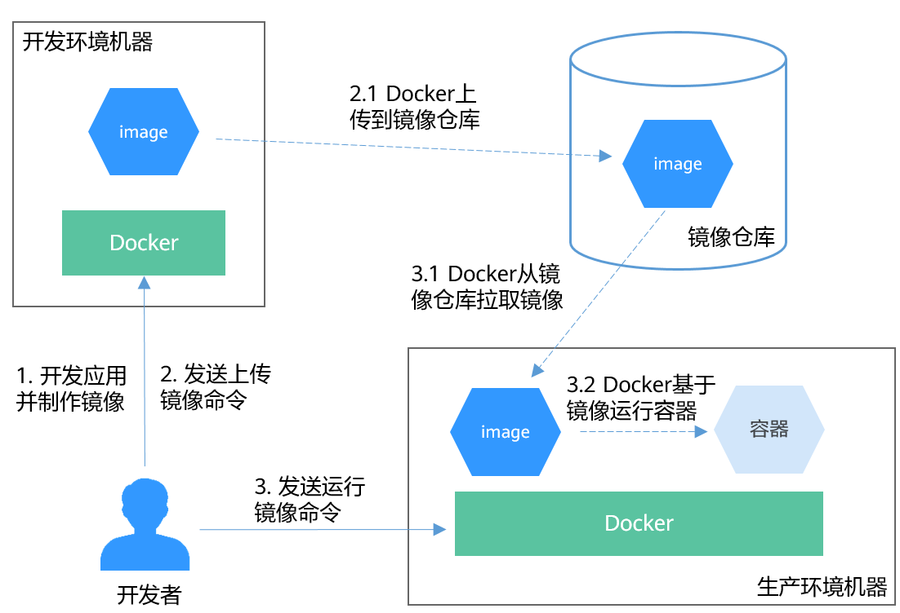
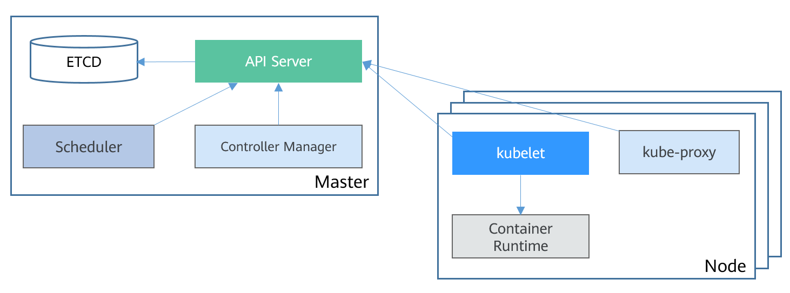

>NOTE:本文参考[华为云文档](https://support.huaweicloud.com/basics-cce/kubernetes_0002.html)

# 1 容器与Kubernetes

## 1.1 容器

### 1 容器优点

相比于虚拟机，容器具有如下优点：

- 更高效的资源利用
- 更快速的启动时间
- 一致的运行环境
- 更轻松的迁移、维护和扩展

### 2 Docker容器典型的使用流程

Docker容器的主要概念：

- 镜像：Docker镜像包含了已打包的应用程序及其依赖的环境。它包含应用程序可用的文件系统和其他元数据，如镜像运行时的可执行文件路径
- 镜像仓库：Docker镜像仓库用于存放Docker镜像。
- 容器：一个运行中的容器就是一个运行在Docker主机上进程。

Docker容器典型使用流程如下图所示：

## 1.2 Kubernetes

### 1.2.1 是什么

kubernetes是一个部署和管理容器化应用，并对容器进行调度和编排的软件系统。

kubernetes提供了服务发现、伸缩、负载均衡、自愈设置选举等功能，让开发者从基础设施相关配置等解脱出来。

### 1.2.2 集群架构

Kubernetes集群包括master节点和node节点。应用部署在node节点上，且可以通过配置选择应用部署在某些特定节点上。kubernetes集群架构如下图所示：

#### master节点

master节点是集群的控制节点，主要由一下4个组件构成：

- API server：集群的入口，接受外部请求，并将信息写入etcd。是个组件相关通信的中转站。
- scheduler：调度应用，根据各种条件(如可用资源、节点亲和性等)将容器调度到node上。
- controller manager：执行集群级功能，如复制组件，跟踪node节点，处理节点故障等
- etcd：分布式数据存储，负责存储集群的配置信息

生产环境中，为了保证集群的高可用，通常会部署多个Master。

#### node节点

node节点是集群的计算节点，即运行容器化应用的节点。主要包含以下组件：

- kubelet: kubelet主要负责同container runtime打交道，并与API server交互，管理节点上的容器。
- kube-proxy:应用组件键的访问代理，解决节点上应用的访问问题。
- container runtime:容器运行时，最主要的功能是下载镜像和运行容器。

### 1.2.3 kubernetes的扩展性

kubernetes开放了容器运行时结构CRI，容器网络接口CNI和容器存储接口CSI，这些接口让kubernetes的扩展性最大化，而kubernetes本身则专注于容器调度。

